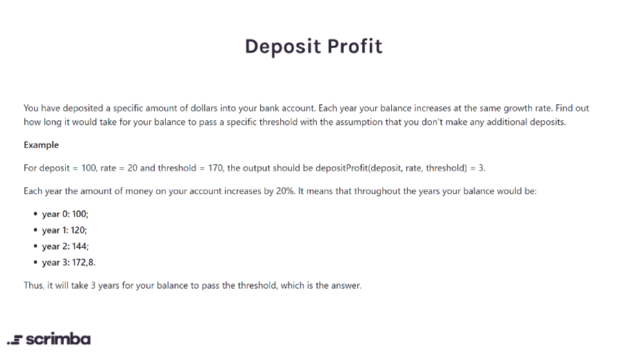

# Javascriptmas

This is a set of programming challenges from [scrimba.com](https://scrimba.com) dubbed [24 days of JavaScriptmas](https://scrimba.com/learn/adventcalendar). It runs from December 01, 2020 - December 23, 2020. Each day a JavaScript challenge is posted and participants are free to attempt and share their solution on twitter.

## Challenges

### Candies


<details>
   <summary>Solution</summary>
   <p>

    ```js
    function candies(children, candy) {
      return Math.floor(candy / children) * children;
    }
    ```
   </p>
</details>

### Deposit profit



<details>
   <summary>Solution</summary>
   <p>

   ```js
   function depositProfit(deposit, rate, threshold) {
    const years = Math.log(threshold / deposit) / Math.log(1 + rate / 100);
    return Number.isInteger(years) ? years + 1 : Math.ceil(years);
  }
  ```

   </p>
</details>

### Chunkey monkey


<details>
  <summary>Solution</summary>
  <p>

  ```js
  function chunkyMonkey(values, size) {
    const chunkedArray = [];
    const arrayLength = values.length;
    for(let i = 0; i < arrayLength; i += size){
        chunkedArray.push(values.slice(i, i + size));
    }
    return chunkedArray;
  }
  ```

  </p>

</details>